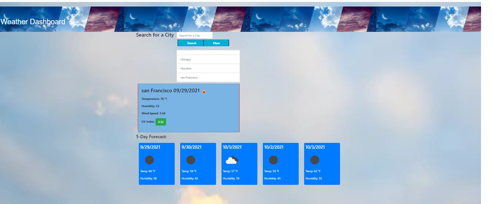

# Description:

I created a weather dashboard application for users to be able to look up both the 
current weather and the 5 day forecast for a city. When the someone searches for a 
city then city is then added to the search history. click that city name it's shows the
city name, date, an icon representing the weather conditions, temperature, humidity, 
wind speed and UV index. Below the current weather conditions shows for 5 day forecast.
Display  date, weather icon, temperature,and humidity.

# Technologies:
HTML
CSS
JavaScript
Bootstrap
Local Storage
Third-Party API :  OpenWeather API

# Deployed Link:

https://patelpr03.github.io/Weather-Dashboard/

# Github:
    https://github.com/patelpr03/Weather-Dashboard

# Screenshot : 

